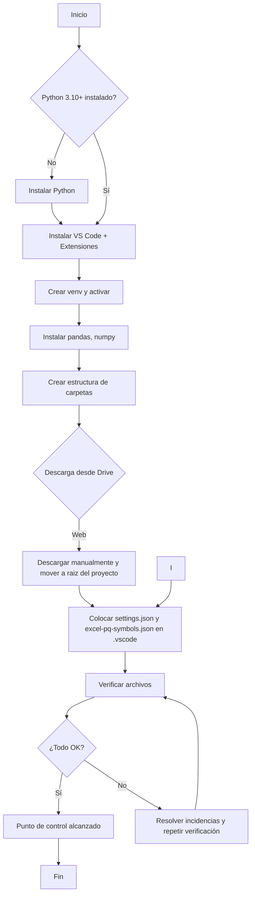

# Documentación del Proyecto: Integración y análisis de datos de ventas

> **Curso:** Fundamentos de Inteligencia Artificial — Trabajo en equipo  
> **Repositorio local:** raíz con archivos `.xlsx` y configuración de VS Code

---

## 1) Tema, problema y solución (vinculados a la base de datos)

**Tema.** Integración y análisis de datos de ventas de una empresa a partir de cuatro fuentes Excel: `clientes.xlsx`, `productos.xlsx`, `ventas.xlsx` y `detalle_ventas.xlsx`.

**Problema.** Los datos están dispersos en varios archivos Excel y se requiere: (a) unificar clientes, productos, ventas y sus detalles; (b) validar y limpiar campos; (c) obtener métricas (totales, promedios) y reportes reproducibles.

**Solución (resumen).**
- Procesar con **Python (pandas)** y ejecutar en **Visual Studio Code** con extensiones de Python/Jupyter.
- Cargar las cuatro tablas Excel, estandarizar columnas/fechas, y **unir** por claves (`cliente_id`, `producto_id`, `venta_id`).
- Calcular métricas y exportar resultados a nuevos Excel o Parquet.  

---

## 2) Fuente, definición, estructura, tipos y escala (según clase 2)

**Fuente de datos.**
- Archivos Excel brindados por el docente:  
  - `clientes.xlsx` — catálogo de clientes (id, nombre, segmento, ciudad, etc.).  
  - `productos.xlsx` — catálogo de productos (id, nombre, categoría, precio unitario).  
  - `ventas.xlsx` — encabezado de venta (venta_id, cliente_id, fecha, etc.).  
  - `detalle_ventas.xlsx` — detalle de líneas (venta_id, producto_id, cantidad, precio, importe).

**Definición de tablas y relaciones.**
- Relación 1:N entre `ventas` (encabezado) y `detalle_ventas` (líneas).
- Dimensiones de **clientes** y **productos** referenciadas por claves foráneas en `ventas`/`detalle_ventas`.

**Estructura del proyecto.**
```
/
├─ clientes.xlsx
├─ productos.xlsx
├─ ventas.xlsx
├─ detalle_ventas.xlsx
├─ documentacion.md  
└─ .vscode/
   ├─ settings.json
   └─ excel-pq-symbols.json
```

**Tipos de archivos.**
- Datos: `.xlsx`
- Código: `.py`, opcional `.ipynb`
- Configuración/editor: `.json`


---

## 3) Pasos, pseudocódigo y diagrama de flujo

> Objetivo: dejar listo el **entorno de trabajo** y los **datos** para iniciar el análisis con Python, **sin** implementar todavía el procesamiento.

### 3.1) Prerrequisitos e instalación

### Herramientas
- **Sistema operativo**: Windows / macOS / Linux.
- **Python 3.10+** (recomendado 3.11 o 3.12). Verificar versión:
  ```bash
  python --version   # o py --version en Windows
  ```
- **Visual Studio Code** con extensiones:
  - *Python* (Microsoft)
  - *Jupyter* (opcional, para notebooks)
- **Git** (opcional, para versionar).
- **Navegador** con acceso a **Google Drive** (para descargar los archivos base).

### Crear entorno virtual e instalar librerías
> Ejecutar estos comandos en una terminal (PowerShell, CMD, o Terminal de VS Code).
```bash
# 1) Crear y activar entorno
python -m venv .venv
# Windows PowerShell
.\.venv\Scripts\Activate.ps1

# 2) Actualizar pip e instalar librerías mínimas
python -m pip install --upgrade pip
pip install pandas numpy 
```

---

### 3.2) Obtener los archivos del **Drive** del docente


1. Abre el **enlace de la carpeta** o los **enlaces de cada archivo** que compartió el docente.
2. En la parte superior, pulsa **Descargar**.
3. Guarda los archivos **.xlsx** y los **.json** de configuración en tus carpetas locales:
   - `clientes.xlsx`, `productos.xlsx`, `ventas.xlsx`, `detalle_ventas.xlsx` 
   - `settings.json`, `excel-pq-symbols.json` → `.vscode/`

---

### 3.4) Pseudocódigo — Inicio del proyecto (sin programar lógica de análisis)

```pseudo
INICIO

# A. Comprobar entorno
SI (python NO instalado) -> instalar Python 3.11+
SI (VS Code NO instalado) -> instalar VS Code y extensiones Python/Jupyter
CREAR entorno virtual .venv
ACTIVAR entorno virtual
INSTALAR librerías: pandas, numpy

# B. Preparar estructura
COPIAR a .vscode: settings.json y excel-pq-symbols.json 

# C. Obtener datos desde Google Drive
SI (descarga manual) -> bajar archivos .xlsx y mover a la raiz del proyecto
VERIFICAR que existan: clientes.xlsx, productos.xlsx, ventas.xlsx, detalle_ventas.xlsx

# D. Validaciones mínimas (sin análisis todavía)
ABRIR cada Excel para confirmar que se puede leer (p. ej., con Excel o Vista Previa)
ACTUALIZAR documentacion.md con cualquier incidencia

# E. Punto de control
CONFIRMAR checklist:
  - [ ] Entorno activo (.venv)
  - [ ] Librerías instaladas
  - [ ] Estructura de carpetas creada
  - [ ] Archivos .xlsx presentes 
  - [ ] Configuración VS Code en .vscode
FIN
```

---

### 5.1) Diagrama de flujo (preparación del entorno y datos)



---

## 6) Checklist imprimible (rápida)
- [ ] Python 3.10+ instalado (`python --version`).
- [ ] VS Code + extensión **Python** (y **Jupyter** opcional).
- [ ] Entorno virtual **.venv** activado.
- [ ] `pip install pandas numpy ` ejecutado.
- [ ] Estructura creada ( `.vscode`).
- [ ] Archivos descargados desde Drive y ubicados.
- [ ] Archivos de configuración dentro de `.vscode/`.

---


